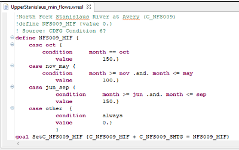
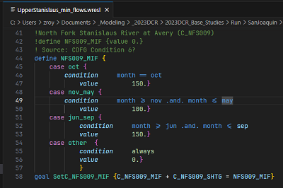

# wresl README

This extension provides support for the Water Resources Simulation Language WRESL and it's replacement WRESL+.

Ths extension provides simple syntax highlighting and code snippets to assist CA DWR staff in developing CalSim.

WRIMS 2 | VS Code with WRESL Extension
:---:|:---:
  |  
